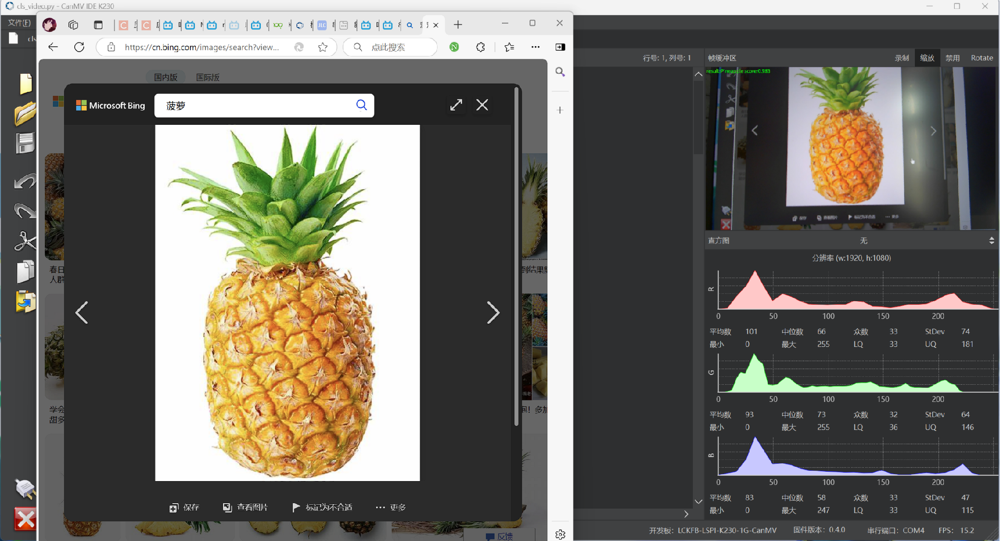
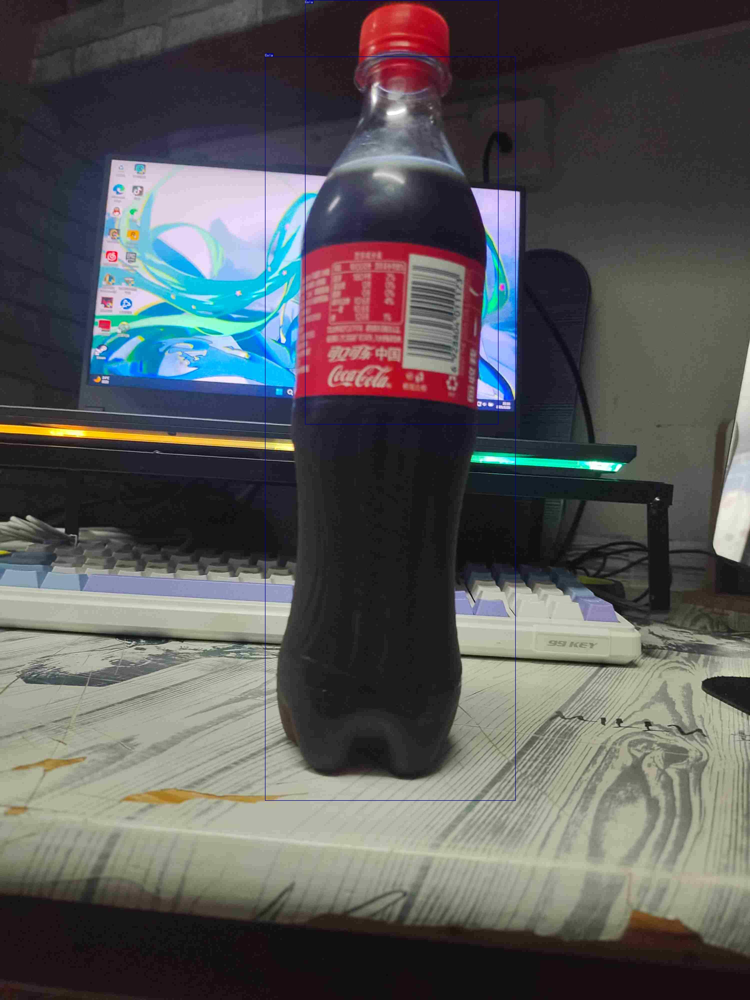
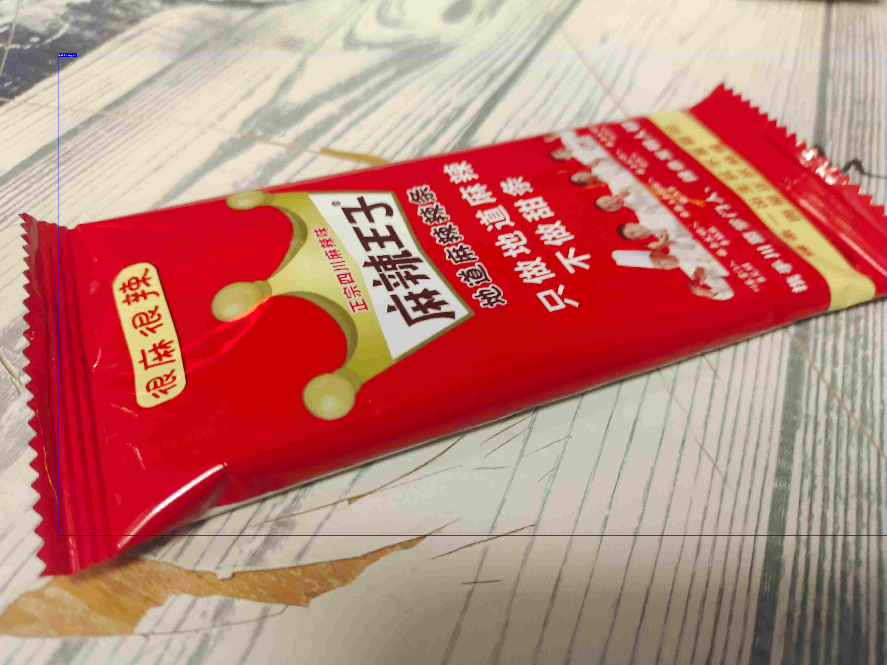
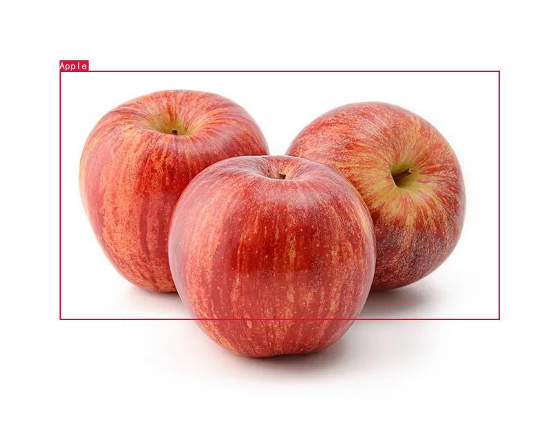

<p align="center">
  
</p>

<h1 align="center">K230 图片识别 — YOLO11 视觉模型</h1>

<p align="center">
  <strong>基于 Kendryte K230 的 YOLO11 边缘端商品实时检测系统</strong>
</p>

<p align="center">
  
  
  
  
  
  
</p>

---

## 项目简介

本项目基于 **Kendryte K230** RISC-V AI 开发板，部署 **YOLO11** 视觉模型，实现边缘端实时商品检测。系统通过摄像头采集画面，运行目标检测推理，识别 **7 类商品**（水果与饮料），并将检测结果通过 UART 串口发送至 **ESP32-S3** 微控制器，形成完整的边缘 AI 检测流水线。

<p align="center">
  
  <br>
  <em>完整检测流水线：屏幕显示 → K230 摄像头采集 → 实时推理 → 检测结果输出</em>
</p>

---

## 检测效果

| 可乐 (Cola) | 麻辣王子 (MALAwangzi) | 苹果 (Apple) |
|:---:|:---:|:---:|
|  |  |  |

---

## 系统架构

```
┌─────────────────────────────────────────────────┐
│              K230 开发板 (CanMV)                  │
│                                                 │
│  ┌──────────┐  ┌──────────┐  ┌──────────────┐  │
│  │ 摄像头    │→ │ YOLO11   │→ │  OSD 叠加显示 │  │
│  │ 1280×720 │  │ 推理引擎  │  │  HDMI/LCD    │  │
│  └──────────┘  └────┬─────┘  └──────────────┘  │
│                     │                            │
│  ┌──────────────────▼───────────────────────┐   │
│  │  NNCASE 2.9.0 推理引擎                    │   │
│  │  · 输入：640×640 RGB                      │   │
│  │  · 后处理：Anchor-Based Detection         │   │
│  │  · 输出：7 类检测框 + 置信度               │   │
│  └──────────────────┬───────────────────────┘   │
│                     │                            │
│  ┌──────────────────▼───────────────────────┐   │
│  │  UART2 (TX=Pin11, RX=Pin12, 9600 baud)  │   │
│  │  发送格式："ClassName confidence\n"        │   │
│  └──────────────────┬───────────────────────┘   │
└─────────────────────┼───────────────────────────┘
                      │
                      ▼
┌─────────────────────────────────────────────────┐
│              ESP32-S3 DevKitC-1                  │
│                                                 │
│  · UART1 (RX=Pin5, TX=Pin4, 9600 baud)         │
│  · 接收 K230 检测结果                            │
│  · 转发至 USB 串口监视器                          │
└─────────────────────────────────────────────────┘
```

---

## 检测类别

模型支持 **7 类商品**的实时检测：

| 序号 | 类别 | 英文名 |
|------|------|--------|
| 0 | 苹果 | Apple |
| 1 | 香蕉 | Banana |
| 2 | 可乐 | Cola |
| 3 | 麻辣王子 | MALAwangzi |
| 4 | 菠萝 | Pineapple |
| 5 | 草莓 | Strawberries |
| 6 | 西瓜 | watermelon |

---

## 技术栈详解

### K230 推理引擎

| 技术 | 说明 |
|------|------|
| **开发板** | Kendryte K230 (CanMV 平台) |
| **支持硬件** | CanMV K230、01Studio CanMV K230、立创庐山派 |
| **推理框架** | NNCASE 2.9.0 |
| **模型架构** | YOLO11 (Anchor-Based Detection) |
| **模型格式** | `.kmodel` (6.0 MB) |
| **输入分辨率** | 640 × 640 |
| **预处理** | AI2D 硬件加速：Bilinear 插值 + Pad + 归一化 |
| **后处理** | `aicube.anchorbasedet_post_process()` |
| **Anchor Strides** | [8, 16, 32]，3 组预定义 Anchor |
| **置信度阈值** | 0.25 |
| **NMS 阈值** | 0.6 |
| **编程语言** | MicroPython (CanMV IDE) |

### 摄像头配置

| 参数 | 值 |
|------|-----|
| **AI 通道** | Channel 2, 1280×720, RGB888 Planar |
| **显示通道** | Channel 0, YUV420 |
| **显示模式** | HDMI (1920×1080) / LCD (800×480) |
| **OSD 层** | ARGB8888 叠加层 |

### ESP32-S3 通信

| 参数 | 值 |
|------|-----|
| **芯片** | ESP32-S3 DevKitC-1 |
| **串口** | UART1, 9600 baud, 8N1 |
| **引脚** | RX=GPIO5, TX=GPIO4 |
| **数据格式** | `"ClassName confidence\n"` |

### UART 通信协议

```
K230 → ESP32-S3：

  "Apple 0.85\n"      # 类别名 + 空格 + 置信度 + 换行
  "Cola 0.92\n"
  "Pineapple 0.78\n"
```

---

## 项目结构

```
K230----YOLO11-/
├── README.md
├── .gitignore
├── docs/images/                           # 文档图片
│   ├── demo_screenshot.png                # 完整演示截图
│   ├── detection_cola.jpg                 # 可乐检测结果
│   ├── detection_cola2.jpg                # 可乐检测结果 2
│   ├── detection_malawangzi.jpg           # 麻辣王子检测结果
│   └── apple.jpg                          # 苹果检测结果
├── 商品检测2.0/
│   ├── shangpinjiance/                    # 模型与推理脚本
│   │   ├── deploy_config.json             # 模型配置文件
│   │   ├── det_image.py                   # 静态图片推理脚本
│   │   └── det_video.py                   # 实时视频推理脚本
│   └── det_results/                       # 检测结果图片示例
│       ├── 9527336.jpg
│       ├── 9527342.jpg
│       └── ...
└── ESP32S3与K230UART通信/
    └── ESP32Demo1/
        ├── platformio.ini
        └── src/main.cpp                   # ESP32-S3 UART 接收代码
```

---

## 快速开始

### 1. K230 端 (MicroPython)

```bash
# 使用 CanMV IDE 连接 K230 开发板
# 将以下文件复制到 SD 卡的 /shangpinjiance/ 目录：
#   - deploy_config.json
#   - det_video.py (实时检测) 或 det_image.py (静态图片)
#   - best_AnchorBaseDet_can2_10_s_20250325170947.kmodel

# 在 CanMV IDE 中运行 det_video.py 即可开始实时检测
```

### 2. ESP32-S3 端

```bash
cd ESP32S3与K230UART通信/ESP32Demo1
pio run -t upload
pio device monitor    # 查看接收的检测结果
```

### 3. 运行效果

- K230 连接摄像头和 HDMI/LCD 显示器
- 运行 `det_video.py`，屏幕实时显示检测框和类别
- ESP32-S3 串口监视器输出检测结果

---

## 模型信息

| 属性 | 值 |
|------|-----|
| **模型文件** | `best_AnchorBaseDet_can2_10_s_20250325170947.kmodel` |
| **训练框架** | YOLO11 |
| **转换工具** | nncase 2.9.0 |
| **模型大小** | 6.0 MB |
| **输入尺寸** | 640 × 640 × 3 |
| **类别数** | 7 |
| **归一化** | mean=[0.485, 0.456, 0.406], std=[0.229, 0.224, 0.225] |

---

## 开发板兼容性

| 开发板 | 状态 |
|--------|------|
| CanMV K230 | ✅ 支持 |
| 01Studio CanMV K230 | ✅ 支持 |
| 立创庐山派 (LCKFB) | ✅ 支持 |

---

## 许可证

本项目采用 [MIT License](LICENSE) 开源协议。

---

<p align="center">
  <sub>Made with K230 CanMV + YOLO11 + ESP32-S3</sub>
</p>
